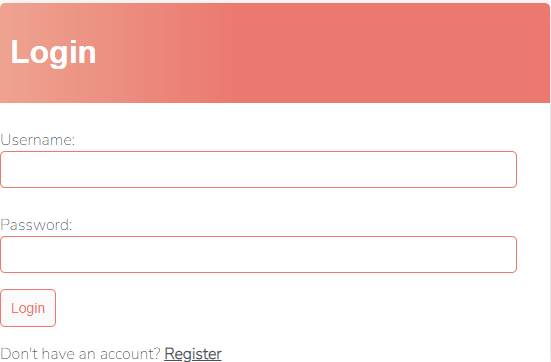
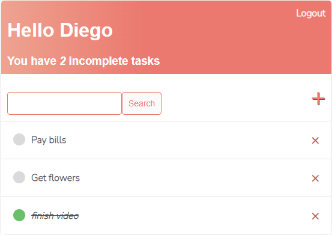
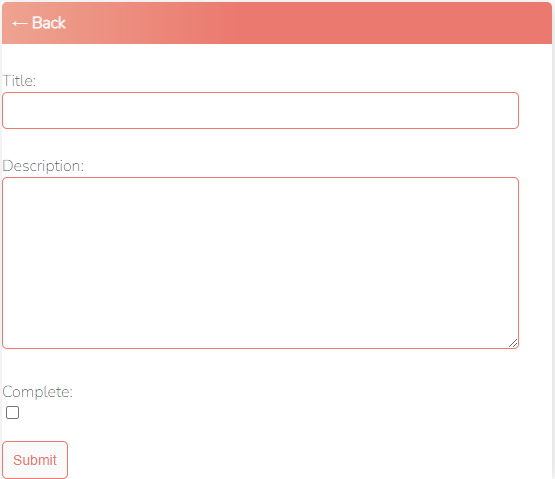

# **📒 To Do List with Django**
**⭐ What better way to learn Django's Class Based Views than through a practical project?**
#### ✅ This is a simple web application for managing a to-do list, developed with Django, using only CBVs.<br>
The features implemented are:
- a user registration/login system;


- A homepage where the user can view the list of tasks to be done and those already completed;


- add new tasks, update or delete them.




---
_Requirements_ <br>
To use this application, you need to have the following installed:

- Python 3.6 or higher
- Django 2.1 or higher

_Installation_ <br>
To install this application, follow these steps:

1. Clone the repository on your machine:

```python
git clone https://github.com/diegoddie/todolist_django.git
```

2. Enter the project folder:

```python
cd todolist_django
```

3. Install the required dependencies with pip:

```python
pip install -r requirements.txt
```

4. Run the migrations to create the database:

```python
python manage.py migrate
```

5. Create a superuser to access the administration area:

```python
python manage.py createsuperuser
```

_Usage_<br>
To start the application, run the following command:

```python
python manage.py runserver
```

You can now access the application at http://127.0.0.1:8000/ in your web browser.
To access the administration area, go to http://127.0.0.1:8000/admin/ and use the superuser credentials you created during installation.

